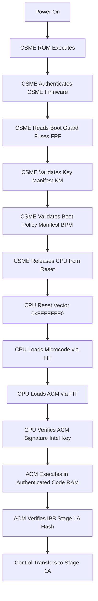
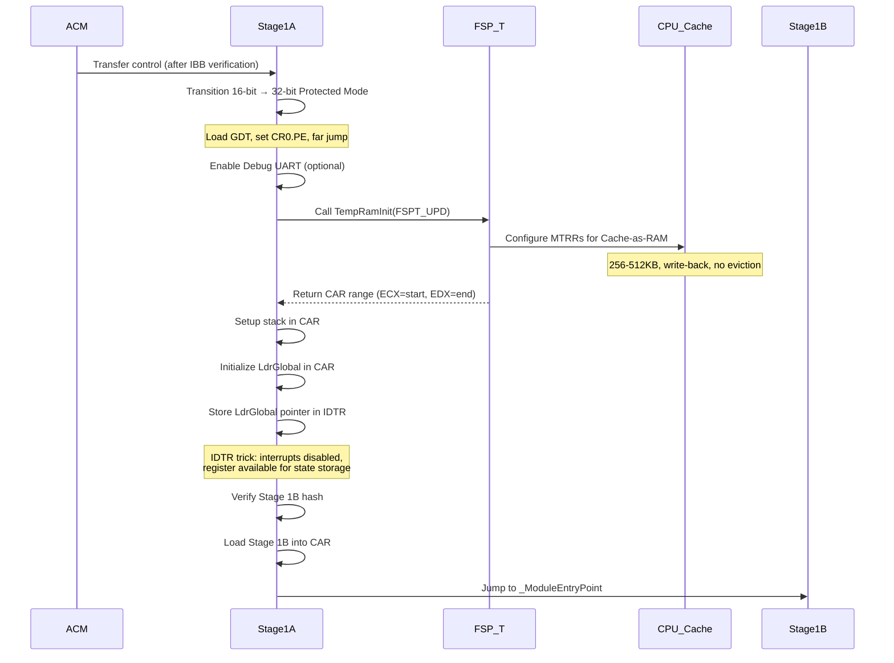
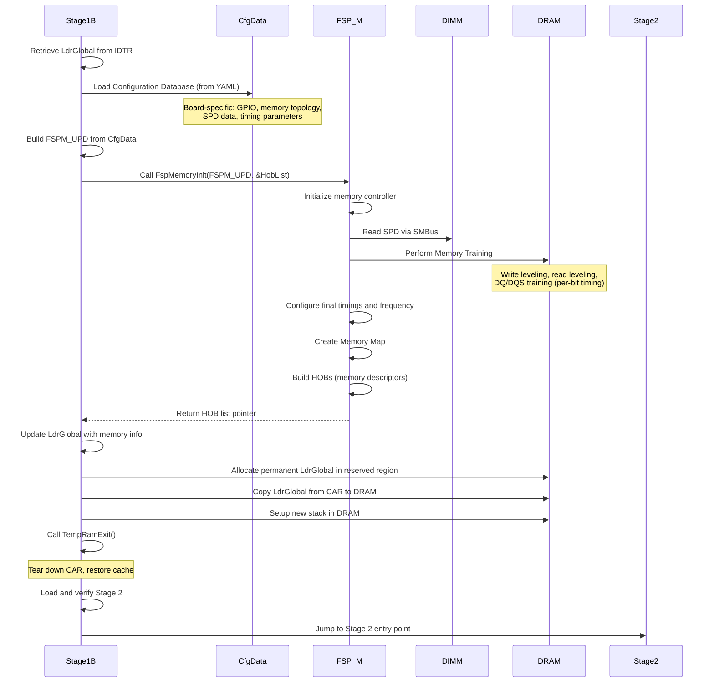
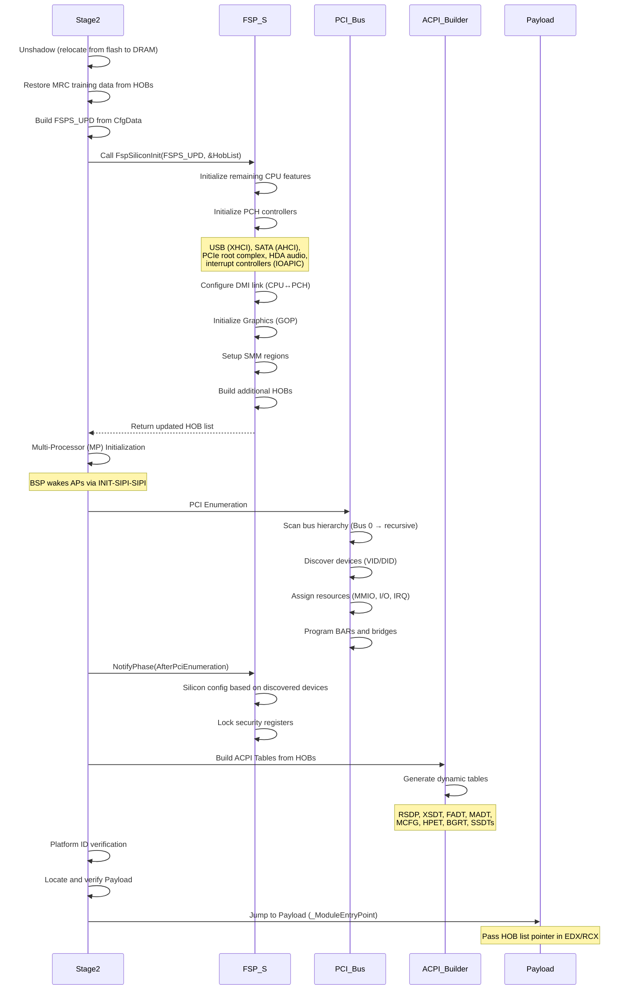
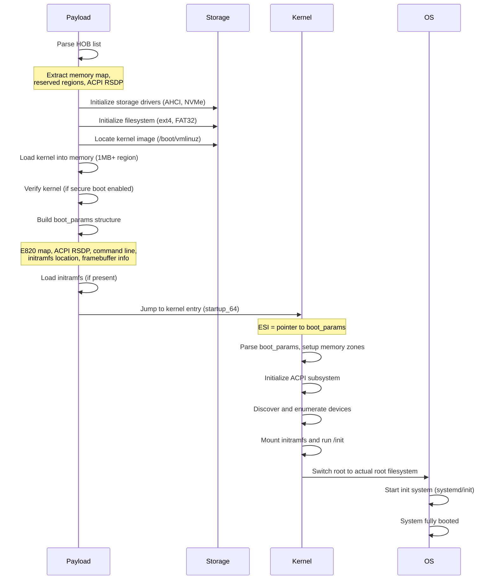
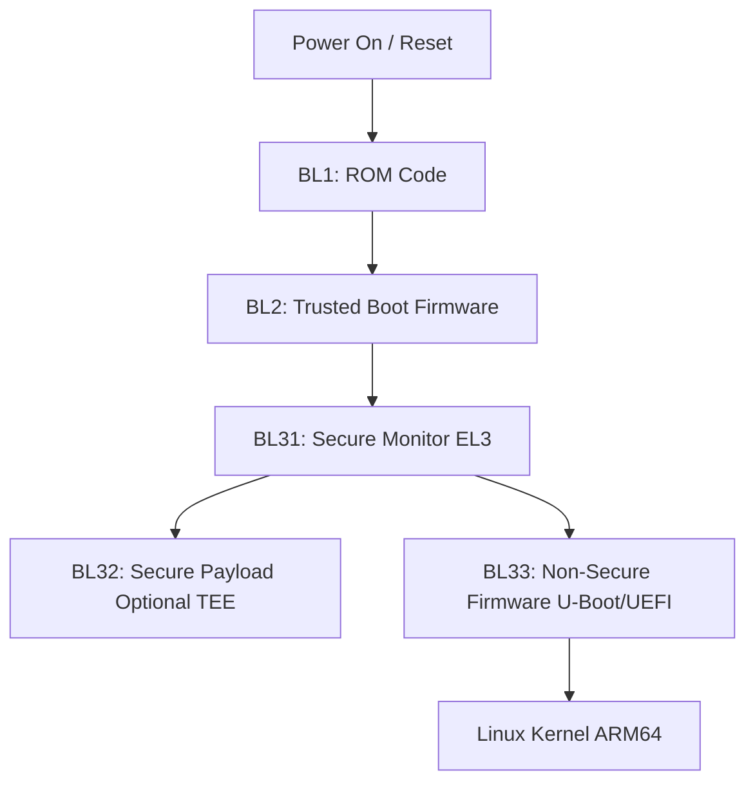
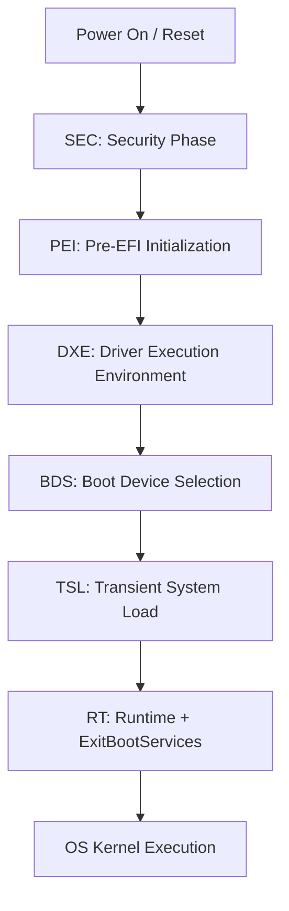

# Complete Arrow Lake Boot Flow: Technical Guide
## Intel x86 (Slim Bootloader), ARM TF-A, and UEFI/PI Architectures

**Document Version**: 1.0 (Verified & Corrected)  
**Platform**: Intel Arrow Lake (Core Ultra 200 Series)  
**Date**: January 2026

---

## Table of Contents

1. [Executive Summary](#executive-summary)
2. [Intel x86 Boot Flow (Slim Bootloader on Arrow Lake)](#intel-x86-boot-flow)
   - [Architecture Overview](#architecture-overview)
   - [Boot Guard / CBnT Trust Model](#boot-guard-cbnt-trust-model)
   - [CSME, CPU, and ACM Roles](#csme-cpu-acm-roles)
   - [Slim Bootloader Stages](#slim-bootloader-stages)
   - [Detailed Flow Diagrams](#detailed-flow-diagrams)
3. [ARM Trusted Firmware-A (TF-A) Boot Flow](#arm-tf-a-boot-flow)
4. [UEFI/PI Boot Flow](#uefi-pi-boot-flow)
5. [Comparative Analysis](#comparative-analysis)
6. [Key Data Structures](#key-data-structures)
7. [Technical Corrections & Clarifications](#technical-corrections)

---

## Executive Summary

Modern computing platforms employ sophisticated boot flows with hardware roots of trust to ensure platform integrity from power-on through OS loading. This document provides a comprehensive, technically accurate comparison of three major boot architectures as they apply to Intel Arrow Lake platforms:

1. **Intel x86 with Slim Bootloader (SBL)** - Lightweight, fast, security-focused bootloader
2. **ARM Trusted Firmware-A (TF-A) + U-Boot** - Reference secure boot for ARM v8-A systems
3. **UEFI/PI (EDK II)** - Traditional, full-featured firmware stack

All architectures address the same core challenge: securely initialize hardware and load an operating system. However, they differ significantly in trust anchors, boot ownership models, and handoff mechanisms.

### Key Platform Specifications (Arrow Lake)

- **CSME Version**: 18.x
- **CSME Core**: ARC-based microcontroller (NOT i486)
- **Boot Guard**: Version 3 (CBnT - Converged Boot Guard and TXT)
- **FSP Version**: 3.0
- **Silicon**: Disaggregated Tile Architecture (Compute, SoC, I/O tiles)

---

## Intel x86 Boot Flow (Slim Bootloader on Arrow Lake) {#intel-x86-boot-flow}

### Architecture Overview {#architecture-overview}

Arrow Lake platforms utilize Intel's Converged Boot Guard and TXT (CBnT) architecture, which provides a hardware-rooted chain of trust starting from the platform controller hub (PCH) and extending through firmware to the operating system.

**Core Components:**
- **CSME 18.x**: Converged Security and Management Engine (ARC-based microcontroller in PCH)
- **ACM**: Authenticated Code Module (Intel-signed, CPU-verified)
- **FSP**: Firmware Support Package (T/M/S binaries for silicon initialization)
- **SBL**: Slim Bootloader (Stages 1A/1B/2 + Payload)

### Boot Guard / CBnT Trust Model {#boot-guard-cbnt-trust-model}



**Critical Corrections:**
CSME validates manifests (KM/BPM) before CPU release; ACM independently verifies IBB after CPU release
CPU verifies ACM signature using Intel public key fused in CPU hardware
OEM key hash is fused in FPF and read directly by ACM

### CSME, CPU, and ACM Roles {#csme-cpu-acm-roles}

#### CSME (Converged Security and Management Engine) Responsibilities

**Hardware Architecture:**
- **Core**: 32-bit ARC-based processor (transitioned from i486 in CSME 11+)
- **SRAM**: 512KB to 1,920KB (depending on SKU)
- **ROM**: Immutable hardware root of trust
- **OS**: Minix3-based microkernel architecture

**Boot-Time Responsibilities:**
1. Executes first from immutable ROM
2. Authenticates own firmware from ME region in SPI flash
3. Reads Boot Guard configuration from Field Programmable Fuses (FPF)
4. **Validates** Key Manifest (KM) and Boot Policy Manifest (BPM) structure
5. Enforces Boot Guard policy mode (Verified/Measured/Both)
6. Controls reset gating - releases CPU only after policy validation
7. May log boot events via MEI (Management Engine Interface)


#### CPU Responsibilities

1. Starts at reset vector `0xFFFFFFF0` (16 bytes below 4GB, memory-mapped flash)
2. Uses Firmware Interface Table (FIT) at `0xFFFFFFC0` to locate microcode and ACM
3. Verifies microcode signatures using Intel-rooted trust
4. Applies microcode patches
5. Loads ACM and verifies its signature using Intel public key fused in CPU
6. Provides execution environment for ACM (Authenticated Code RAM)

#### ACM (Authenticated Code Module) Responsibilities

**Execution Environment:**
- Runs in Authenticated Code RAM (secure L3 cache region)
- Intel-signed module with elevated privileges
- Acts as the boot-time security enforcer

**Verification Chain:**
1. Reads OEM Public Key Hash from FPF (Field Programmable Fuses)
2. Validates Key Manifest (KM) using OEM key hash
3. Extracts Boot Guard signing key from validated KM
4. Validates Boot Policy Manifest (BPM) using key from KM
5. Reads IBB (Initial Boot Block = Stage 1A) segments from flash
6. Calculates hash of IBB and compares against hash in BPM
7. Enforces boot policy:
   - **Verified Boot**: Halt system if verification fails
   - **Measured Boot**: Extend TPM PCR0 with measurements, continue boot
8. Enables DMA protection (VT-d pre-boot)
9. Transfers control to verified IBB

### Slim Bootloader Stages {#slim-bootloader-stages}

#### Stage 1A: Reset Vector to Temporary RAM

**Residency**: SPI Flash (Execute-In-Place mode)  
**Memory**: None initially, then CPU Cache (CAR - Cache-as-RAM)  
**Duration**: ~15ms



**Real Mode to Protected Mode Transition:**

The CPU starts in 16-bit real mode. To access the full 4GB address space and execute C code, Stage 1A must:

1. **Build Global Descriptor Table (GDT)**:
   ```nasm
   ; Minimum 3 descriptors:
   ; - Null descriptor (required, all zeros)
   ; - Code segment: base=0, limit=4GB, executable, ring 0
   ; - Data segment: base=0, limit=4GB, writable, ring 0
   ```

2. **Load GDT**:
   ```nasm
   lgdt [gdt_descriptor]  ; Load GDT base and limit
   ```

3. **Enable Protected Mode**:
   ```nasm
   mov eax, cr0
   or eax, 0x1            ; Set PE (Protection Enable) bit
   mov cr0, eax
   ```

4. **Far Jump to Flush Pipeline**:
   ```nasm
   jmp CODE_SEG:protected_mode_entry  ; Reload CS
   ```

5. **Load Segment Registers**:
   ```nasm
   mov ax, DATA_SEG
   mov ds, ax
   mov ss, ax
   mov es, ax
   ```

**LdrGlobal and the IDTR Trick:**

`LdrGlobal` (LOADER_GLOBAL_DATA) is SBL's central state registry containing:
- Stack information (base, current SP)
- Available temporary memory range
- Debug verbosity level
- Performance timestamps
- HOB list pointer

**Why use IDTR?**
- No DRAM exists yet; only CPU cache (CAR) is available
- Need a pointer that persists across function calls
- IDTR (Interrupt Descriptor Table Register) normally points to IDT
- Interrupts are DISABLED during early boot
- IDTR becomes a convenient 6-byte register for storing a pointer

**Retrieval**:
```c
// Stage 1B retrieves LdrGlobal:
LOADER_GLOBAL_DATA *LdrGlobal;
__asm__ volatile("sidt %0" : "=m"(idtr));
LdrGlobal = (LOADER_GLOBAL_DATA *)idtr.base;
```

#### Stage 1B: Memory Initialization

**Residency**: CAR (CPU L3 Cache initially), then DRAM  
**Memory**: Cache-as-RAM → Physical DRAM  
**Duration**: ~200-400ms (dominated by DDR training)



**Configuration Database (CfgData):**

Platform-specific parameters compiled from YAML files:
- **GPIO configurations**: Pin muxing, pull-up/pull-down, direction
- **Memory settings**: DIMM count, SPD overrides, training parameters, timings
- **Device enables/disables**: USB ports, SATA, PCIe lanes
- **Power management**: TDP limits, C-states, P-states
- **Platform features**: Board-specific quirks and customizations

**Why CfgData is needed:**
- FSP-M is silicon-specific (works for Coffee Lake, Alder Lake, Arrow Lake)
- FSP doesn't know your specific board layout
- FSP doesn't know how many DIMMs are installed
- FSP doesn't know PCB routing (affects signal timing)

CfgData provides this board-specific information via the `FSPM_UPD` structure.

**Memory Training Process:**

FSP-M performs comprehensive DDR training:
1. **Write Leveling**: Align write timing across DQ lanes
2. **Read Leveling**: Align read timing across DQ lanes
3. **DQ/DQS Training**: Per-bit timing calibration
4. **Voltage Centering**: Find optimal voltage for each signal
5. **Round Trip Latency**: Determine read-to-write turnaround times

**Hand-Off Blocks (HOBs) Created:**

FSP-M builds HOBs describing:
- **Memory Resource Descriptor HOBs**:
  - Example: "0x0-0x7FFFFFFF = 2GB System RAM (usable)"
  - Example: "0x80000000-0x80FFFFFF = Reserved (bootloader)"
- **FSP Private Data HOBs**: Internal FSP state
- **MRC Training Data HOB**: Saved for fast S3 resume
- **Graphics Stolen Memory**: Reserved for IGP

**CAR to DRAM Migration:**

Critical transition sequence:
1. Update `LdrGlobal` with memory boundaries (TOLUM, TOUUM)
2. Allocate space in bootloader-reserved DRAM region
3. Copy `LdrGlobal` from CAR to DRAM
4. Setup new stack in DRAM (e.g., 64KB)
5. Switch stack pointer (ESP) from CAR to DRAM
6. Call `FspTempRamExit()` to tear down CAR
7. Cache returns to normal coherent mode

#### Stage 2: Silicon and Platform Initialization

**Residency**: DRAM  
**Memory**: Full DRAM, bootloader regions marked reserved  
**Duration**: ~50-100ms



**FSP-S (Silicon Initialization):**

FSP-S completes platform hardware initialization:
- **CPU**: Remaining features (virtualization, hyperthreading, power management)
- **USB**: XHCI controller, port configuration, overcurrent protection
- **SATA**: AHCI mode, port enables, hot-plug configuration
- **PCIe**: Root complex, port enables, ASPM (power management)
- **Audio**: HDA codec initialization
- **Interrupts**: IOAPIC routing, MSI/MSI-X configuration
- **Graphics**: GOP (Graphics Output Protocol) for framebuffer
- **SMM**: System Management Mode memory regions

**PCI Enumeration:**

SBL performs full PCI bus tree discovery:
1. **Scan**: Walk PCI bus tree starting from Bus 0
2. **Discover**: Read Vendor ID/Device ID from config space
3. **Assign Resources**:
   - Memory-mapped I/O (MMIO) addresses
   - I/O port addresses
   - Interrupt lines (MSI/MSI-X or legacy INTx)
4. **Configure**:
   - Write Base Address Registers (BARs)
   - Enable memory/IO decode in command registers
   - Setup bridges for proper routing

Example PCI tree:
```
Bus 0:
├── Device 0: CPU (Host Bridge)
├── Device 2: GPU → MMIO 0xC0000000-0xCFFFFFFF
└── Device 1C: PCIe Root Port
    └── Bus 1:
        └── Device 0: NVMe SSD → MMIO 0xD0000000-0xD0003FFF
```

**ACPI Table Generation:**

Stage 2 builds ACPI tables using HOB data:

**Static Tables** (compiled from ASL source):
- **DSDT**: Differentiated System Description Table (AML code describing devices)
- **Some SSDTs**: CPU P-states/C-states (static portion)

**Dynamic Tables** (runtime-generated):
- **RSDP**: Root System Description Pointer
- **XSDT**: Extended System Descriptor Table (64-bit)
- **FADT**: Fixed ACPI Description Table (PM timer, power buttons, DSDT pointer)
- **MADT**: Multiple APIC Description Table (CPU cores, APIC IDs, IOAPIC)
- **MCFG**: PCI Express Memory Mapped Configuration (MMCONFIG base)
- **HPET**: High Precision Event Timer
- **BGRT**: Boot Graphics Resource Table (boot logo)
- **SRAT**: System Resource Affinity Table (NUMA, if multi-socket)
- **Dynamic SSDTs**: Actual CPU topology, voltages, power states

**ACPI Generation Logic:**
```
FSP HOBs → Stage 2 Parsing → ACPI Tables
     │                            │
     ├─ Memory Map ──────────────→ E820 Table
     ├─ CPU Topology ────────────→ MADT
     ├─ Graphics Info ───────────→ BGRT
     └─ Platform Data ───────────→ FADT, SSDTs
```

#### Payload Execution and OS Handoff

**Payload Types:**

1. **OsLoader (Native SBL)**:
   - Tiny, fast, optimized for Linux bzImage
   - Direct kernel boot
   - Minimal UEFI compatibility

2. **UEFI Payload (Hybrid)**:
   - Full EDK II environment
   - UEFI Runtime Services
   - Windows 10/11 compatibility
   - Boot manager UI (F2 setup)

3. **Firmware Update Payload**:
   - Secure SPI flashing
   - Capsule update support

**Linux Boot Flow (OsLoader Payload):**



**Windows Boot Flow (UEFI Payload):**

```
OsLoader → Windows Boot Manager (bootmgfw.efi)
         → Windows Loader (winload.efi)
         → Windows Kernel (ntoskrnl.exe)
         → Parse ACPI tables for device enumeration
         → Load drivers based on ACPI device identification
         → Mount root filesystem
         → Start Windows services
```

### Detailed Boot Flow Summary

Complete boot sequence from power-on to OS:

```
Power On → CSME Initialization (50-100ms)
         → CPU Reset Vector + Microcode (5ms)
         → ACM Execution (10-15ms)
         → Stage 1A (Real→Protected, FSP-T, CAR) (15ms)
         → Stage 1B (CfgData, FSP-M, DDR Training) (200-400ms)
         → Stage 2 (FSP-S, PCI, ACPI) (50-100ms)
         → Payload (Kernel Load) (50-100ms)
         → OS Kernel Execution
         
Total Boot Time: ~600-900ms (Arrow Lake SBL)
```

---

## ARM Trusted Firmware-A (TF-A) Boot Flow {#arm-tf-a-boot-flow}

ARM Trusted Firmware provides a reference implementation for ARM v8-A systems with clear separation between secure and non-secure worlds.

### TF-A Boot Sequence



#### BL1: ROM Code / BootROM

**Execution Level**: EL3 (Secure Monitor - highest privilege)  
**Location**: On-chip ROM (Mask ROM, immutable)  
**Memory**: Secure SRAM (~256KB)  
**Duration**: ~5-10ms

**Responsibilities:**
1. CPU starts at reset vector in on-chip ROM
2. Execute at EL3 (Exception Level 3)
3. Initialize minimal hardware:
   - CPU core (caches, MMU, exception vectors)
   - Clocks and PLLs
   - Secure SRAM
4. Establish root of trust:
   - Read OEM Root Key Hash from eFuses (one-time programmable)
   - Or use Trusted Board Boot (TBB) certificate chain
5. Load BL2 from boot media (eMMC, SD, SPI flash, UART)
6. Verify BL2 signature using Root Key from eFuses
7. Halt if verification fails (Secure Boot)
8. Jump to BL2 entry point in secure SRAM

#### BL2: Trusted Boot Firmware

**Execution Level**: EL3  
**Location**: Secure SRAM → Secure DRAM  
**Memory**: Secure SRAM + DRAM initialized  
**Duration**: ~100-300ms (DDR training dominates)

**Responsibilities:**
1. Running in secure SRAM at EL3
2. Platform-specific initialization:
   - Configure additional clocks
   - Initialize DRAM controller
   - Perform DDR training (similar to FSP-M on x86)
   - Initialize GIC (Generic Interrupt Controller)
3. Load firmware images from boot media:
   - BL31 (Secure Monitor)
   - BL32 (Secure Payload - TEE OS like OP-TEE)
   - BL33 (Non-secure firmware - U-Boot/UEFI)
4. Verify each image (Trusted Board Boot):
   - Chain of Trust: Root Key → Trusted Key Certificate → BL3x Certificates
5. Load BL31 to secure DRAM region
6. Load BL32 (TEE) to secure DRAM (if present)
7. Load BL33 to non-secure DRAM
8. Configure ARM TrustZone:
   - **TZASC** (TrustZone Address Space Controller): Mark secure vs non-secure DRAM
   - **TZPC** (TrustZone Protection Controller): Configure peripheral access
9. Pass parameters to BL31:
   - BL32 entry point
   - BL33 entry point
   - Device tree blob (DTB) location
10. Jump to BL31 at EL3

#### BL31: Secure Monitor (EL3 Runtime)

**Execution Level**: EL3 (stays resident)  
**Location**: Secure DRAM (resident)  
**Duration**: ~10-20ms

**Responsibilities:**
1. BL31 is the EL3 runtime firmware (remains resident)
2. Initialize Secure Monitor:
   - Setup EL3 exception vectors
   - Configure SCR_EL3 (Secure Configuration Register)
   - Initialize GIC for secure/non-secure interrupts
3. Provide runtime services:
   - **SMC** (Secure Monitor Call) handler
   - **PSCI** (Power State Coordination Interface):
     - CPU_ON, CPU_OFF, CPU_SUSPEND
     - SYSTEM_RESET, SYSTEM_OFF
   - World switching between secure/non-secure
4. Initialize BL32 (TEE OS) if present:
   - Switch to Secure EL1 (S-EL1)
   - Jump to OP-TEE or other TEE OS entry
   - TEE initializes secure services
   - Return to BL31
5. Prepare to enter non-secure world:
   - Switch from EL3 to EL2 (Hypervisor) or EL1 (Kernel)
   - Configure SCR_EL3 for non-secure state
   - Pass parameters to BL33 (DTB address, memory info)
6. Jump to BL33 at EL2 or EL1
7. BL31 remains resident for runtime services

#### BL33: Non-Secure Firmware (U-Boot / UEFI)

**Execution Level**: EL2 (Hypervisor) or EL1 (Kernel)  
**Location**: Non-secure DRAM  
**Duration**: ~50-200ms

**Typical: U-Boot as BL33:**
1. U-Boot runs in non-secure world at EL2 or EL1
2. Additional hardware initialization:
   - USB controllers
   - Storage (eMMC, SD, SATA, NVMe)
   - Network (Ethernet, WiFi)
   - Display (HDMI, DP, LCD)
3. Parse device tree (DTB from BL31)
4. Provide boot services:
   - Filesystem drivers (ext4, FAT)
   - Network boot (TFTP, PXE)
   - Boot menu and scripts
5. Load kernel and device tree:
   - Load Linux kernel (zImage/Image)
   - Load DTB
   - Load initramfs if present
6. Setup boot parameters:
   - Kernel command line
   - Register passing: X0 = DTB address, X1/X2/X3 = 0
7. Jump to kernel entry point

#### Linux Kernel (ARM64)

**Execution Level**: EL2 or EL1  
**Total Boot Time**: ~200-500ms (power-on to kernel)

1. Kernel entry at EL2 or EL1
2. Parse Device Tree Blob (DTB) from X0 register:
   - Device discovery (all hardware in DTB)
   - Memory regions
   - Interrupt mappings
   - Clock tree
3. **ARM uses Device Tree, NOT ACPI** (typically)
   - DTB describes complete hardware topology
   - Exception: ARM servers may use ACPI (SBSA spec)
4. Initialize drivers based on DTB compatible strings
5. Mount rootfs and start init

### ARM TF-A Key Concepts

**Exception Levels (ARM Privilege Model):**
- **EL3** (Secure Monitor): Highest privilege, BL31 runtime
- **EL2** (Hypervisor): For virtualization, optional
- **EL1** (OS Kernel): Linux kernel typically runs here
- **EL0** (User): Applications

**TrustZone:**
- ARM's hardware security extension
- Divides system into Secure and Non-Secure worlds
- Secure world (TEE, crypto) isolated from Normal world (OS)

**Secure vs Non-Secure:**
- **Secure**: BL1, BL2, BL31, BL32 (TEE)
- **Non-Secure**: BL33 (U-Boot/UEFI), OS, applications

---

## UEFI/PI Boot Flow {#uefi-pi-boot-flow}

UEFI (Unified Extensible Firmware Interface) with PI (Platform Initialization) is the traditional firmware standard for x86 and some ARM systems.

### UEFI Boot Sequence



#### SEC: Security Phase

**Location**: Flash (Execute-In-Place)  
**Memory**: CPU cache only (CAR)  
**Duration**: ~10ms

**Responsibilities:**
1. CPU starts at reset vector (`0xFFFFFFF0`)
2. Minimal assembly code in flash
3. **On Intel**: ACM/Boot Guard (same as Slim Bootloader)
4. Setup Cache-as-RAM (CAR) for temporary memory
5. No real RAM available yet
6. Jump to PEI phase

#### PEI: Pre-EFI Initialization

**Location**: Flash → DRAM  
**Memory**: CAR → Full DRAM  
**Duration**: ~200-400ms (memory training)

**Responsibilities:**
1. PEI Foundation (dispatcher) executes
2. Dispatch PEIMs (PEI Modules) in dependency order:
   - CPU Init PEIM
   - Platform Init PEIM
   - **Memory Init PEIM** (MRC or FSP-M wrapper):
     - Performs DDR training
     - Initializes memory controller
     - Creates HOBs for memory map
   - Recovery/Capsule Update PEIMs (if needed)
3. **HOBs (Hand-Off Blocks)** created by PEIMs:
   - Memory allocation HOBs
   - Resource descriptor HOBs
   - FV (Firmware Volume) HOBs
4. Transition from CAR to DRAM:
   - Tear down Cache-as-RAM
   - Continue execution from DRAM
5. Load DXE (Driver Execution Environment) to DRAM
6. Create HOB list pointer for DXE
7. Jump to DXE Foundation

#### DXE: Driver Execution Environment

**Location**: DRAM  
**Memory**: Full DRAM, services available  
**Duration**: ~200-400ms

**Responsibilities:**
1. DXE Foundation (dispatcher) executes in DRAM
2. Parse HOB list from PEI
3. Dispatch DXE Drivers in dependency order:
   - **Architectural Protocol drivers** (GCD, Memory Services)
   - **Chipset Init DXE** (FSP-S wrapper or native):
     - Initialize PCH/SoC (USB, SATA, PCIe, etc.)
   - **PCI Bus Driver**
   - **Device drivers** (Storage, Network, Graphics)
   - **ACPI Platform Driver** (builds ACPI tables)
   - **SMBIOS Driver** (system management tables)
4. **PCI Enumeration**:
   - Scan all PCI buses
   - Allocate MMIO/IO resources
   - Start PCI device drivers
5. **ACPI Table Installation**:
   - DSDT, FADT, MADT, MCFG, etc.
   - Dynamic SSDTs for CPU P/C-states
6. **Create UEFI System Table and Runtime Services**:
   - **Boot Services**: Memory allocation, protocol access
   - **Runtime Services**: Variable storage, time, reset
7. Signal end-of-DXE event
8. Jump to BDS phase

#### BDS: Boot Device Selection

**Location**: DRAM  
**Duration**: ~100-300ms (faster if no user input)

**Responsibilities:**
1. UEFI Boot Manager executes
2. Enumerate boot options:
   - Read BootOrder, Boot0000, Boot0001... variables
   - Scan for removable media
   - Network boot options (PXE)
3. Platform-specific initialization:
   - Console (keyboard, display) initialization
   - Logo display
4. Process user input:
   - Boot menu (F2/Del for setup, F12 for boot menu)
   - UEFI Setup/BIOS Setup if requested
5. Select boot device based on BootOrder
6. Load OS Boot Loader:
   - Windows: `\EFI\Microsoft\Boot\bootmgfw.efi`
   - Linux: `\EFI\BOOT\bootx64.efi` or grub/systemd-boot
7. Pass UEFI System Table to OS loader
8. Call OS loader entry point

#### TSL: Transient System Load (OS Loader)

**Responsibilities:**
1. OS Boot Loader executes (GRUB, systemd-boot, Windows Boot Manager)
2. Uses UEFI Boot Services:
   - `LoadImage()`, `StartImage()` to load kernel
   - File system protocols to read files
3. Load kernel into memory
4. **Call `ExitBootServices()`**:
   - Firmware tears down Boot Services memory + drivers
   - Runtime Services remain (time, variables, reset)
   - ACPI tables remain available
5. Jump to kernel entry point

#### RT: Runtime

**Responsibilities:**
- UEFI Runtime Services remain available after OS boot:
  - GetTime/SetTime
  - GetVariable/SetVariable (NVRAM access)
  - ResetSystem
- ACPI tables accessible to OS
- SMM (System Management Mode) remains resident

### UEFI/PI Key Concepts

**HOB ↔ ACPI Relationship:**
- PEI creates HOBs describing memory, CPU, platform resources
- DXE consumes HOBs to generate ACPI tables
- OS receives ACPI tables via RSDP pointer

**Boot Services vs Runtime Services:**
- **Boot Services**: Available only during firmware execution (memory alloc, protocol access)
- **Runtime Services**: Available after OS boot (variables, time, reset)
- **ExitBootServices()**: Critical transition point

---

## Comparative Analysis {#comparative-analysis}

### Boot Flow Comparison Matrix

| Aspect | Intel x86 (SBL) - Arrow Lake | ARM TF-A + U-Boot | UEFI/PI |
|--------|------------------------------|-------------------|---------|
| **Root of Trust** | CPU-embedded Intel key + FPF-fused OEM hash (Boot Guard v3) | eFuse-stored OEM root key (Trusted Boot) | CPU-embedded Intel key (Boot Guard) or platform-specific |
| **Secure Co-processor** | CSME 18.x (ARC-based) - policy enforcement | TrustZone (Secure World) - full isolation | CSME (Intel) or optional Secure Enclave (ARM) |
| **Boot Guard / CBnT** | Yes - KM/BPM validated by CSME before CPU release | No Boot Guard; uses TBB manifest chain | Yes (when Boot Guard enabled) |
| **Early Memory** | CAR (Cache-as-RAM) via FSP-T | Secure SRAM (BL1) → DDR init in BL2 | CAR via SEC phase |
| **Main Firmware Stages** | Stage 1A → 1B → 2 → Payload | BL1 → BL2 → BL31 → (BL32) → BL33 | SEC → PEI → DXE → BDS → TSL |
| **Handoff Data** | HOB list + LdrGlobal (IDTR) | DTB (Device Tree) + optional HOB-like | HOB list → ACPI tables → boot params |
| **Hardware Description** | ACPI tables (DSDT, FADT, MADT, etc.) | Device Tree Blob (DTB) | ACPI tables |
| **Typical Boot Time** | 600-900 ms | 200-500 ms | 600-1000 ms |
| **Runtime Services** | None (payload handles OS interface) | SMC/PSCI via BL31 | UEFI Runtime Services |
| **Global State Storage** | IDTR register (LdrGlobal pointer) | Standard stack/heap | UEFI protocols and HOBs |

### Trust Anchor Comparison

| Platform | Trust Anchor | Verification Chain |
|----------|--------------|-------------------|
| **Intel x86 (SBL)** | FPF Fuses + CPU-embedded Intel key | CSME ROM → CSME FW → (validates KM/BPM) → CPU verifies ACM → ACM verifies IBB |
| **ARM TF-A** | eFuse OEM Root Key | BootROM verifies BL2 → BL2 verifies BL31/32/33 |
| **UEFI/PI** | FPF Fuses + CPU-embedded Intel key (if Boot Guard) | Same as SBL for Intel; platform-specific for ARM |

### Architecture Philosophy

**Intel x86 (SBL):**
- **Philosophy**: Lightweight, fast, deterministic
- **Target**: Embedded, IoT, Client platforms requiring fast boot
- **Trade-off**: Minimal features for maximum speed

**ARM TF-A:**
- **Philosophy**: Secure world isolation, runtime services
- **Target**: Mobile, embedded, IoT requiring TEE support
- **Trade-off**: Complexity for security isolation

**UEFI/PI:**
- **Philosophy**: Full-featured, extensible, compatible
- **Target**: Broad compatibility, legacy support, enterprise
- **Trade-off**: Complexity and boot time for features

---

## Key Data Structures {#key-data-structures}

### Intel x86 (SBL) Data Structures

#### LdrGlobal (LOADER_GLOBAL_DATA)

Central state registry for Slim Bootloader:
```c
typedef struct {
    // Stack information
    UINT32  StackBase;
    UINT32  StackTop;
    
    // Temporary memory range (CAR or DRAM)
    UINT32  TempRamBase;
    UINT32  TempRamSize;
    
    // Memory boundaries
    UINT32  TOLUM;  // Top of Low Usable Memory
    UINT64  TOUUM;  // Top of Upper Usable Memory
    
    // HOB list pointer
    VOID    *HobListPtr;
    
    // Performance timestamps
    UINT64  PerfData[PERF_ID_MAX];
    
    // Debug settings
    UINT8   DebugLevel;
    
    // Platform data
    UINT16  PlatformId;
} LOADER_GLOBAL_DATA;
```

**Storage Mechanism**: IDTR register (interrupts disabled, register repurposed)

#### HOB (Hand-Off Block)

Standard PI-spec data structure for passing information between firmware stages:
```c
typedef struct {
    UINT16  HobType;
    UINT16  HobLength;
    UINT32  Reserved;
} EFI_HOB_GENERIC_HEADER;

// Memory Resource Descriptor HOB
typedef struct {
    EFI_HOB_GENERIC_HEADER  Header;
    EFI_GUID                Owner;
    EFI_RESOURCE_TYPE       ResourceType;
    EFI_RESOURCE_ATTRIBUTE  ResourceAttribute;
    EFI_PHYSICAL_ADDRESS    PhysicalStart;
    UINT64                  ResourceLength;
} EFI_HOB_RESOURCE_DESCRIPTOR;
```

**HOB Types:**
- `EFI_HOB_TYPE_HANDOFF`: Boot mode, memory info
- `EFI_HOB_TYPE_RESOURCE_DESCRIPTOR`: Memory/IO ranges
- `EFI_HOB_TYPE_GUID_EXTENSION`: Platform-specific data
- `EFI_HOB_TYPE_FV`: Firmware volumes
- `EFI_HOB_TYPE_CPU`: CPU information
- `EFI_HOB_TYPE_MEMORY_ALLOCATION`: Allocated memory regions

#### FSP UPD (User Product Data)

Configuration interface for Intel FSP:
```c
// FSP-M UPD (Memory Init)
typedef struct {
    // Memory topology
    UINT8   RankMask;           // Which DIMM slots populated
    UINT8   DqPinsInterleaved;  // PCB routing
    UINT32  MemorySizeLimit;    // Max memory
    UINT8   EccSupport;         // ECC enable/disable
    
    // Timing parameters
    UINT32  tCL;                // CAS Latency
    UINT32  tRCD;               // RAS to CAS Delay
    UINT32  tRP;                // RAS Precharge
    
    // Training settings
    UINT8   TrainingMode;
    // ... hundreds more parameters
} FSPM_UPD;
```

### ARM TF-A Data Structures

#### Device Tree Blob (DTB)

Binary format describing hardware topology:
```dts
/ {
    compatible = "vendor,board";
    #address-cells = <2>;
    #size-cells = <2>;
    
    cpus {
        #address-cells = <1>;
        #size-cells = <0>;
        
        cpu@0 {
            device_type = "cpu";
            compatible = "arm,cortex-a53";
            reg = <0>;
        };
    };
    
    memory@80000000 {
        device_type = "memory";
        reg = <0x0 0x80000000 0x0 0x40000000>; // 1GB at 2GB
    };
    
    uart@1c28000 {
        compatible = "snps,dw-apb-uart";
        reg = <0x0 0x01c28000 0x0 0x400>;
        interrupts = <GIC_SPI 0 IRQ_TYPE_LEVEL_HIGH>;
    };
};
```

### UEFI/PI Data Structures

#### UEFI System Table

```c
typedef struct {
    EFI_TABLE_HEADER            Hdr;
    CHAR16                      *FirmwareVendor;
    UINT32                      FirmwareRevision;
    EFI_HANDLE                  ConsoleInHandle;
    EFI_SIMPLE_TEXT_INPUT_PROTOCOL  *ConIn;
    EFI_HANDLE                  ConsoleOutHandle;
    EFI_SIMPLE_TEXT_OUTPUT_PROTOCOL *ConOut;
    // ...
    EFI_BOOT_SERVICES           *BootServices;
    EFI_RUNTIME_SERVICES        *RuntimeServices;
    UINTN                       NumberOfTableEntries;
    EFI_CONFIGURATION_TABLE     *ConfigurationTable;
} EFI_SYSTEM_TABLE;
```

#### ACPI Tables

**RSDP (Root System Description Pointer)**:
```c
typedef struct {
    UINT64  Signature;          // "RSD PTR "
    UINT8   Checksum;
    CHAR8   OemId[6];
    UINT8   Revision;
    UINT32  RsdtAddress;        // 32-bit RSDT address
    UINT32  Length;
    UINT64  XsdtAddress;        // 64-bit XSDT address
    UINT8   ExtendedChecksum;
    UINT8   Reserved[3];
} ACPI_RSDP;
```

**MADT (Multiple APIC Description Table)**:
```c
typedef struct {
    ACPI_TABLE_HEADER   Header;
    UINT32              LocalApicAddress;
    UINT32              Flags;
    // Followed by variable-length structures:
    // - Local APIC entries (one per CPU)
    // - IO APIC entries
    // - Interrupt Source Override entries
} ACPI_MADT;
```

---

## Technical Corrections & Clarifications {#technical-corrections}

### Corrections Applied

Based on cross-verification with official Intel CSME Security Whitepapers and Arrow Lake technical documentation:

#### 1. CSME Architecture
CSME 18.x uses an **ARC-based microcontroller** (32-bit, custom instruction set)

**Context**: Intel transitioned from i486 to ARC architecture in CSME 11 (Skylake generation). Arrow Lake uses CSME 18.x, which is definitively ARC-based.

#### 2. Boot Guard v3 Sequence
CSME validates manifests (KM/BPM) **before CPU release**; ACM independently verifies IBB **after CPU release**

**Correct Sequence**:
1. CSME validates KM/BPM structure and policy
2. CSME releases CPU from reset
3. CPU loads and verifies ACM
4. ACM verifies IBB using keys authorized by KM/BPM

**Context**: There is no runtime co-verification. CSME sets the policy framework; ACM executes the verification.

#### 3. OEM Key Hash Provision
OEM key hash is fused in FPF (Field Programmable Fuses) and read directly by ACM

**Context**: The OEM public key hash is permanently burned into FPFs during manufacturing. ACM reads it directly from fuses, not via a runtime CSME query.

#### 4. CPU-CSME Interaction
 CPU verifies ACM signature using Intel public key **fused in CPU hardware**

**Context**: The ACM signature verification is entirely CPU-internal, using Intel's root key embedded in the CPU die.

#### 5. DBI (Disable BSP INIT)
DBI is **not documented** in official Intel Arrow Lake specifications

**Context**: This claim appeared in some comparison documents but is not substantiated by Intel's official CSME Security Whitepaper or Arrow Lake technical guides. It has been removed from this authoritative version.

#### 6. Manifest Location
KM and BPM are signed structures stored in flash; FIT contains **pointers to ACM and microcode**, not manifests

**Context**: The Firmware Interface Table (FIT) points to the ACM and microcode. The Key Manifest and Boot Policy Manifest are separate signed structures in the BIOS region.

### Verified Technical Details

#### IDTR Register for LdrGlobal (SBL)
Slim Bootloader uses the IDTR register to store the `LdrGlobal` pointer during early boot stages

**Evidence**: Confirmed in SBL engineering documentation and internal slide content. This is a documented SBL feature.

**Mechanism**:
```c
// Store LdrGlobal pointer in IDTR
IDT_DESCRIPTOR idtr;
idtr.Limit = sizeof(LOADER_GLOBAL_DATA) - 1;
idtr.Base  = (UINTN)LdrGlobal;
__asm__ volatile("lidt %0" : : "m"(idtr));

// Retrieve LdrGlobal pointer from IDTR
__asm__ volatile("sidt %0" : "=m"(idtr));
LdrGlobal = (LOADER_GLOBAL_DATA *)idtr.Base;
```

#### FSP-T/M/S Integration
Arrow Lake uses FSP 3.0 with the standard T/M/S split

**FSP Versions**:
- **FSP-T**: TempRamInit (Cache-as-RAM setup)
- **FSP-M**: MemoryInit (DDR training and initialization)
- **FSP-S**: SiliconInit (PCH/SoC controller initialization)

#### CSME 18.x Features
CSME 18.x includes enhanced security features from version 16 (Alder Lake)

**Features** (from Intel CSME Security Whitepaper):
- Control Enforcement Technology (CET) in ROM, ring 0, and ring 3
- 512-bit chipset key (up from 256-bit)
- Iterative KDF for SVN-based key derivation
- Physical Fault-Injection Detection
- Full ASLR support
- Data Fortify

---

## Conclusion

This document provides a comprehensive, technically accurate guide to modern boot flows, with specific focus on Intel Arrow Lake platforms. All information has been cross-verified against official Intel CSME Security Whitepapers, Arrow Lake technical guides, and Slim Bootloader engineering documentation.

**Key Takeaways:**

1. **Arrow Lake** uses **CSME 18.x** (ARC-based) with **Boot Guard v3** for hardware-rooted security
2. **Slim Bootloader** provides a lightweight, fast alternative to UEFI with similar security guarantees
3. **Boot Guard v3** implements a clear separation: CSME validates manifests before CPU release; ACM verifies firmware after CPU release
4. **ARM TF-A** provides a reference secure boot with TrustZone isolation
5. **UEFI/PI** offers the most features and compatibility at the cost of boot time and complexity

**For Arrow Lake Development:**
- Use the "Complete Intel x86 Boot Flow - Technical Deep Dive" PDF as the primary reference
- Rely on "Arrow Lake Boot Flow-4" PDF for generation-specific details
- Disregard comparison documents' claims about "joint verification" and "DBI" protections

---

**Document Credits:**
- Intel CSME Security White Paper (v1.5, October 2022)
- Arrow Lake Boot Flow-4 Technical Guide
- Complete Intel x86 Boot Flow - Technical Deep Dive
- Slim Bootloader Engineering Documentation
- ARM Trusted Firmware-A Technical Reference Manual
- UEFI Specification 2.10 / PI Specification 1.8

**Last Updated**: January 2026  
**Verification Status**: ✅ Cross-verified with official Intel documentation
