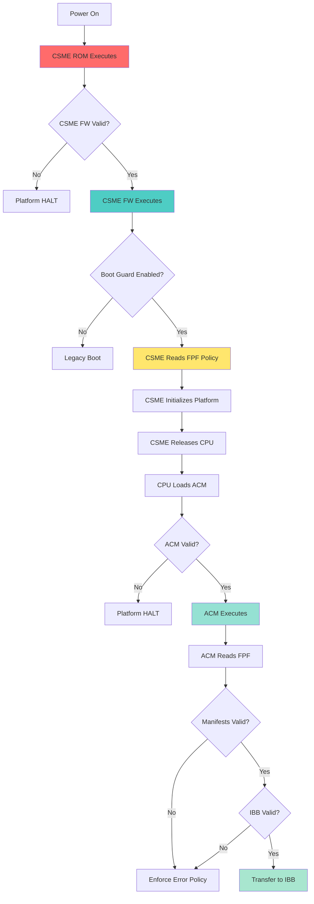

# CSME's Critical Security Role in Boot Guard

> [!IMPORTANT]
> This document clarifies **why CSME is essential** to Boot Guard security even though ACM performs manifest validation. CSME and ACM have **complementary, not redundant** roles.

---

## The Core Question

**If CPU authenticates ACM, and ACM authenticates manifests using PCH registers, what's the need for CSME?**

**Answer:** CSME provides the **platform security foundation** that makes Boot Guard possible. Without CSME, Boot Guard cannot function.

---

## Understanding the PCH Registers (FPF Fuses)

### What Are FPF Fuses?

**FPF (Field Programmable Fuses)** are **hardware fuses** in the PCH (Platform Controller Hub) silicon.

```
PCH Silicon (Physical Chip)
  ├─ CSME (processor core inside PCH)
  ├─ FPF Fuses (hardware registers - one-time programmable)
  ├─ Other PCH logic (DMI, I/O controllers, etc.)
  └─ SPI Flash Controller
```

### Are FPF Fuses "Stored by CSME"?

**No - FPF fuses are independent hardware storage.**

| Aspect | Details |
|--------|---------|
| **Physical Location** | Inside PCH silicon die |
| **Type** | One-Time Programmable (OTP) fuse array |
| **Programming** | Done via CSME tools during manufacturing |
| **Storage** | **Hardware fuses** (physical, permanent) |
| **Ownership** | PCH hardware (not CSME software) |
| **Access** | Can be read by CSME and ACM |

**Analogy:**
```
Think of PCH as a building:
- CSME: Security guard (active processor)
- FPF Fuses: Safe in the wall (passive hardware storage)
- ACM: Auditor who comes in later

The security guard (CSME) can program the safe and read it.
The safe exists independently in the building's structure.
The auditor (ACM) can also read the safe to verify things.
```

### How FPF Fuses Are Programmed:

```
Manufacturing Process:
  1. Platform assembled (PCH installed)
  2. OEM generates Boot Guard root key
  3. OEM uses Intel tools that communicate with CSME
  4. Commands sent to CSME: "Program these FPF values"
  5. CSME executes hardware fuse programming
  6. Fuses are PERMANENTLY burned (OTP)
  7. EOM (End of Manufacturing) lock set
  8. Fuses can NEVER be changed again
```

**Key Point:** CSME is the **programming interface** for fuses, but fuses are **hardware storage** that both CSME and ACM can read.

---

## CSME's Critical Security Roles

### Role 1: Platform Gatekeeper (Power-On Security)

**CSME controls whether the platform can boot at all.**

```
Power Applied
  ↓
PCH Power Rails Initialize
  ↓
CSME Released from Reset (FIRST THING TO EXECUTE)
  ↓
┌────────────────────────────────────────┐
│ CSME Security Checkpoint #1            │
│ "Should I even let this platform boot?"│
├────────────────────────────────────────┤
│ • Is ME firmware authentic?            │
│ • Are platform fuses in valid state?   │
│ • Is platform stolen/blocked?          │
│ • Are there critical errors?           │
└────────────────────────────────────────┘
  ↓
If ANY check fails → Platform HALTS
If checks pass → Continue
  ↓
CSME Releases CPU from Reset
```

**Without CSME:** CPU would never start. Platform is dead.

### Role 2: ME Firmware Authentication

**CSME authenticates itself using immutable ROM.**

```
CSME Boot Chain:
  CSME ROM (Immutable, burned in silicon)
    Contains: Intel public key
    ↓
  Authenticate CSME Firmware (from SPI flash)
    Using: RSA signature verification
    ↓
  If invalid: HALT platform (security breach)
  If valid: Execute CSME firmware
```

**Why this matters:**
- CSME has deep platform access (SMBus, SPI, DMI, etc.)
- Compromised CSME = full platform control
- CSME self-authentication prevents malicious ME firmware
- This happens **before CPU even starts**

### Role 3: Boot Guard Policy Enforcement

**CSME reads and enforces Boot Guard configuration.**

```c
// Conceptual: CSME Boot Guard initialization
void csme_boot_guard_init() {
    // Read Boot Guard policy from FPF
    boot_guard_config_t config;
    config.enabled = read_fpf(FPF_BOOT_GUARD_ENABLE);
    config.mode = read_fpf(FPF_BOOT_GUARD_MODE);
    config.oem_key_hash = read_fpf(FPF_OEM_KEY_HASH);
    config.error_enforcement = read_fpf(FPF_ERROR_POLICY);
    
    if (!config.enabled) {
        // Boot Guard disabled - allow normal boot
        release_cpu_reset();
        return;
    }
    
    // Boot Guard enabled - enforce policy
    if (config.mode == BOOT_GUARD_DISABLED_BY_JUMPER) {
        // Physical jumper overrides - check jumper
        if (physical_disable_jumper_present()) {
            log_event("Boot Guard bypassed by jumper");
            release_cpu_reset();
            return;
        }
    }
    
    // Verify platform configuration
    if (!platform_config_valid(&config)) {
        // Platform configuration error
        enforce_error_policy(&config);
        // May halt or continue based on policy
    }
    
    // Setup Boot Guard environment for ACM
    setup_boot_guard_msrs(&config);
    prepare_manifest_access();
    
    // Release CPU to perform ACM validation
    release_cpu_reset();
}
```

**CSME determines:**
- Is Boot Guard enabled at all?
- What mode: Verified, Measured, or Both?
- What to do on errors: Halt or log?
- Are there platform-specific overrides?

### Role 4: Platform Initialization (The "Starter Motor")

**CSME initializes critical platform components that the CPU requires to execute its first instruction.**

| Component | Why the CPU needs CSME to initialize it | Official Citation |
| :--- | :--- | :--- |
| **PMC (Power Controller)** | CSME must apply a firmware patch to the PMC before CPU reset release. | *"A system cannot boot without a proper, PMC patch" (Line 705)* |
| **Clocks** | CPU requires stable BCLK (Base Clock) to cycle. | *"Base initialization of PCH... configuration of clocks" (Line 276)* |
| **SPI Controller** | CPU must read BIOS/ACM from SPI. CSME maps it into the CPU's memory space. | *"Decompression conducted by the SPI controller" (Line 485)* |
| **GPIO** | Pins for hardware straps and "Power Good" signals. | *"Base initialization... configuration of clocks and GPIO" (Line 276)* |

**Key Point:** The CPU is physically incapable of running without the CSME first "preparing the ground." If the PMC is not patched or clocks aren't configured, the CPU won't even wake up to look for an ACM.

### How CSME accesses SPI Flash (The "Chicken and Egg" Solution)
A common question: *If CSME needs firmware from SPI Flash, but the SPI Controller needs initialization, how does CSME start?*

*   **Hardwired ROM**: The CSME Boot ROM is built into the silicon transistors. It doesn't need to be "loaded."
*   **Hardware Default SPI**: The SPI controller has a hardware-wired default state. The hardwired Boot ROM invokes a **Direct Memory Access (DMA)** request to the SPI controller (**Line 483**).
*   **No Code Required**: This first read is handled by logic gates, not software drivers. This allows the CSME to pull its own updatable firmware into SRAM without any pre-existing software.

### Role 5: Runtime Security Services

**CSME provides ongoing security functions during OS runtime.**

```
CSME Runtime Services:
  ├─ Platform Trust Technology (PTT) / fTPM
  ├─ Intel Active Management Technology (AMT)
  ├─ Intel Dynamic Application Loader (DAL)
  ├─ Secure boot key storage
  ├─ Cryptographic acceleration
  ├─ Platform attestation
  └─ Protected audio/video path (PAVP)
```

---

## How CSME Links into the Security Check

### The Complete Security Chain (CSME + ACM)



### Security Checkpoint Breakdown (The "Platform Gateway")

| Phase | Checkpoint | Guardian | Trust Anchor | What's Validated | If Fails |
| :--- | :--- | :--- | :--- | :--- | :--- |
| **Preparation** | **#1: CSME FW** | CSME ROM | Intel key in ROM | CSME firmware signature | Platform halt |
| (Platform)    | **#2: BG Policy** | CSME FW | FPF fuses | Policy configuration | Apply policy |
|               | **#3: Hardware** | CSME FW | Platform state | Clocks / PMC Patch | May halt |
| **Auditing**    | **#4: ACM** | CPU uCode | Intel key in CPU | ACM signature | Platform halt |
| (Authoritative)| **#5: KM** | ACM | BP.KEY (FPF) | OEM Root Key Manifest | Apply policy |
|               | **#6: BPM** | ACM | Key from KM | Boot Policy Manifest | Apply policy |
|               | **#7: IBB** | ACM | Hash from BPM | Stage1A Integrity | Apply policy |

**CSME handles Phase 1 (Preparation), ACM handles Phase 2 (Authoritative Audit).**

---

## CSME vs ACM: Complementary Roles

### Different Security Domains

```
┌─────────────────────────────────────────────────┐
│ CSME Security Domain                            │
├─────────────────────────────────────────────────┤
│ • Platform-level security                       │
│ • ME firmware integrity                         │
│ • Platform initialization gating                │
│ • Boot Guard policy enforcement                 │
│ • Runtime security services                     │
│ • Happens BEFORE CPU boots                      │
└─────────────────────────────────────────────────┘

┌─────────────────────────────────────────────────┐
│ ACM Security Domain                             │
├─────────────────────────────────────────────────┤
│ • BIOS firmware integrity                       │
│ • Cryptographic validation (KM/BPM/IBB)         │
│ • Isolated execution (AC RAM)                   │
│ • Independent verification                      │
│ • Happens AFTER CPU boots, BEFORE BIOS          │
└─────────────────────────────────────────────────┘
```

### Why Both Are Needed

**Without CSME:**
- ❌ Platform never initializes
- ❌ CPU never releases from reset  
- ❌ No Boot Guard policy enforcement
- ❌ No ME firmware authentication
- ❌ No platform security foundation

**Without ACM:**
- ❌ No BIOS firmware verification
- ❌ No cryptographic chain of trust
- ❌ BIOS could be malicious
- ❌ Boot Guard cannot validate firmware

**Together:**
- ✅ Platform security from power-on
- ✅ ME firmware authenticated
- ✅ BIOS firmware authenticated  
- ✅ Complete chain of trust
- ✅ Defense in depth

---

## The FPF Question: Fused or Stored by CSME?

### Correct Understanding:

**FPF fuses are:**
- ✅ Hardware fuse array in PCH silicon
- ✅ Programmed via CSME interface during manufacturing
- ✅ Permanently stored in silicon (OTP)
- ✅ Independent of CSME software
- ✅ Readable by both CSME and ACM

**FPF fuses are NOT:**
- ❌ "Stored by CSME" (they're hardware storage)
- ❌ In CSME's memory or firmware
- ❌ Modifiable by CSME after EOM
- ❌ Dependent on CSME being functional to exist

### Access Pattern:

```c
// Both CSME and ACM can read the same fuses

// In CSME firmware:
uint8_t oem_key_hash[32];
read_fpf_hardware(FPF_BP_KEY_OFFSET, oem_key_hash, 32);
// CSME uses this for policy enforcement

// In ACM code:
uint8_t oem_key_hash[32];
read_fpf_hardware(FPF_BP_KEY_OFFSET, oem_key_hash, 32);
// ACM uses this for manifest validation
```

### Physical Architecture:

```
PCH Silicon Die:
┌───────────────────────────────────────┐
│                                       │
│  ┌──────────────┐                     │
│  │  CSME Core   │                     │
│  │  (Processor) │                     │
│  └───────┬──────┘                     │
│          │                            │
│          │ reads                      │
│          ↓                            │
│  ┌──────────────┐                     │
│  │  FPF Fuses   │◄───────────────────┼─── ACM can also read
│  │  (Hardware)  │                     │    (via PCH interface)
│  │              │                     │
│  │ • BP.KEY     │                     │
│  │ • BP.TYPE    │                     │
│  │ • BP.RSTR    │                     │
│  └──────────────┘                     │
│                                       │
│  [Other PCH Logic]                    │
│                                       │
└───────────────────────────────────────┘
```

---

## Real-World Analogy: Secure Building

```
Platform Security = Secure Building

┌─────────────────────────────────────────────┐
│ Building Manager (CSME)                     │
├─────────────────────────────────────────────┤
│ • Opens building in morning (powers on)     │
│ • Checks their own credentials first        │
│ • Reads security policy from safe           │
│ • Initializes building systems              │
│ • Decides if building can operate           │
│ • Calls security auditor if policy requires │
│ • Provides ongoing building services        │
└─────────────────────────────────────────────┘

┌─────────────────────────────────────────────┐
│ Safe in Wall (FPF Fuses)                    │
├─────────────────────────────────────────────┤
│ • Contains security policy                  │
│ • Contains root key for document validation │
│ • Manager can read it                       │
│ • Auditor can read it (independently)       │
│ • Programmed once during construction       │
│ • Cannot be changed after that              │
└─────────────────────────────────────────────┘

┌─────────────────────────────────────────────┐
│ Security Auditor (ACM)                      │
├─────────────────────────────────────────────┤
│ • Arrives after building opens              │
│ • Reads same policy from safe               │
│ • Validates important documents (manifests) │
│ • Checks first-floor security (IBB)         │
│ • Doesn't trust manager's word              │
│ • Does independent verification             │
│ • Allows employees in if all checks pass    │
└─────────────────────────────────────────────┘

Question: "If auditor validates documents, why need manager?"

Answer:
- Without manager: Building never opens!
- Without manager: No power, lights, HVAC
- Without auditor: Unchecked documents could be malicious
- Both needed: Manager runs building, auditor validates security

Same with CSME and ACM:
- CSME: Makes platform operational
- ACM: Validates firmware security
- Both essential for secure boot
```

---

## Timeline: CSME and ACM Working Together

```
T=0ms: Power Applied
  └─ CSME ROM begins execution

T=10ms: CSME authenticates own firmware
  └─ Uses Intel key in CSME ROM
  └─ If fail: Platform halts

T=50ms: CSME reads FPF fuses
  └─ BP.KEY (OEM root key hash)
  └─ Boot Guard policy settings
  └─ CSME knows: "Boot Guard is enabled"

T=100ms: CSME initializes platform
  └─ PMC, SPI, DMI, clocks
  └─ Platform now functional

T=150ms: CSME releases CPU from reset
  ╔══════════════════════════════════════╗
  ║ CPU NOW STARTS (first time it runs) ║
  ╚══════════════════════════════════════╝

T=151ms: CPU executes reset vector
  └─ Reads FIT table

T=152ms: CPU loads ACM from FIT
  └─ Verifies ACM signature (Intel key in CPU)
  └─ If fail: Platform halts

T=160ms: ACM executes in AC RAM
  └─ Reads SAME FPF fuses CSME read earlier
  └─ ACM knows: "Boot Guard is enabled"

T=165ms: ACM validates Key Manifest
  └─ Uses OEM key hash from FPF
  └─ If fail: Apply error policy

T=170ms: ACM validates Boot Policy Manifest
  └─ Uses key from KM
  └─ If fail: Apply error policy

T=180ms: ACM validates IBB
  └─ Uses hash from BPM
  └─ If fail: Apply error policy

T=200ms: ACM transfers control to IBB
  └─ BIOS begins execution

Throughout: CSME continues running (runtime services)
```

---

## Summary: Why CSME Is Essential

### CSME's Unique Contributions:

1. **First Mover** - Only thing that executes after power-on
2. **Platform Gatekeeper** - Controls if platform boots at all
3. **ME Security** - Authenticates its own firmware
4. **Policy Authority** - Reads and enforces Boot Guard policy
5. **Platform Initialization** - Makes hardware functional for CPU
6. **FPF Programming Interface** - How fuses get programmed
7. **Runtime Services** - Ongoing security functions

### ACM Cannot Replace CSME Because:

- ❌ ACM doesn't execute until CPU boots
- ❌ CPU cannot boot until CSME releases it
- ❌ ACM has no platform initialization capability
- ❌ ACM cannot authenticate ME firmware
- ❌ ACM cannot program FPF fuses

### ACM's Unique Contributions:

1. **Independent Validation** - Doesn't trust CSME
2. **Cryptographic Verification** - Validates manifest chain
3. **Isolated Execution** - Runs in protected AC RAM
4. **Intel-Signed** - Trusted by CPU hardware
5. **BIOS Protection** - Ensures firmware integrity

### CSME Cannot Replace ACM Because:

- ❌ CSME is complex firmware (larger attack surface)
- ❌ CSME could be compromised
- ❌ Need independent verification (defense in depth)
- ❌ ACM runs in isolated CPU mode
- ❌ ACM is minimal, focused code (smaller TCB)

---

## Conclusion

**CSME and ACM have complementary, essential roles:**

```
CSME → "I make the platform functional and enforce Boot Guard policy"
ACM  → "I independently verify firmware hasn't been tampered with"

Together → Complete platform security from power-on through boot
```

**Both are mandatory for Boot Guard security.**

The FPF fuses are the **shared trust anchor** both use, stored in PCH hardware, accessible to both CSME and ACM for their respective security functions.
