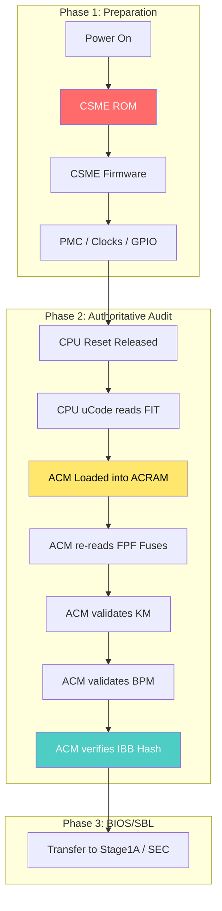

# Intel Boot Guard: Chain of Trust & Critical FAQ Master Guide

> [!IMPORTANT]
> This guide provides the definitive technical explanation of the Intel Boot Guard chain of trust, from the hardwired PCH fuses to the final transfer of control to the Bootloader. It incorporates critical FAQs regarding **SBL applicability**, **manifest flexibility**, and **ACM independence**.

---

## 1. The Chain of Trust Architecture

The Intel Boot Guard security model is a "Zero Trust" relay. Each stage is responsible for the cryptographic validation of the next stage using a pre-verified trust anchor.

---

## 2. Stage-by-Stage Verification Breakdown

| Component | Basis of Verification | Trust Anchor |
| :--- | :--- | :--- |
| **CSME ROM** | Hardwired Silicon Logic | Immutable Logic |
| **CSME FW** | RSA Signature (Intel Key) | Intel Root Key in CSME ROM |
| **ACM** | RSA Signature (Intel Key) | Intel Root Key in CPU Silicon |
| **Key Manifest (KM)** | SHA-256 Hash of Public Key | `BP.KEY` in PCH FPF Fuses |
| **Boot Policy (BPM)** | RSA Signature | Public Key in Verified KM |
| **Initial Boot Block** | SHA-256/384 Hash | Authoritative Hash in Verified BPM |

---

## 3. High-Signal FAQ & Technical Deep-Dives

### Q: Does Boot Guard apply to Slim Bootloader (SBL)?
**YES.** Boot Guard is **bootloader-agnostic**. It verifies the first code to run on the CPU (the Initial Boot Block). 
*   In **UEFI**, the IBB is the SEC/PEI core.
*   In **SBL**, the IBB is **Stage 1A**.
The validation process (KM → BPM → IBB) remains identical regardless of the software that follows.

### Q: Why do we need the Key Manifest (KM)? Why not store IBB hashes in fuses?
**Answer: Flexibility and Key Revocation.**
FPF Fuses are **One-Time Programmable (OTP)**. If you burned the IBB hash directly into silicon:
1.  **Security Updates**: You could never update your BIOS code without a mismatch.
2.  **Key Compromise**: If your signing key leaked, every manufactured motherboard would be permanently compromised.
**The KM/BPM chain** allows the OEM to update their firmware and even revoke their signing keys using Security Version Numbers (SVN) without ever touching the hardware fuses.

### Q: Does ACM trust the CSME's earlier checks?
**Answer: NO.** ACM performs an **independent validation**. 
While CSME prepares the platform and makes the manifests available, the ACM is the "Final Auditor." It re-reads the FPF fuses directly from the PCH hardware (Line 371) to ensure that the manifests it is checking haven't been tampered with by the CSME or an attacker.

---

## 4. Technical Implementation Details

### The ACRAM "Vault" (Line 355)
ACM executes in **Authenticated Code RAM**, which is an isolated segment of the L3 cache. It is protected by hardware logic against:
*   **DMA Attacks**: No external hardware can snoop on ACM code.
*   **Bus Snooping**: Memory transactions are internal to the CPU.

### KM and BPM Details
*   **Key Manifest (KM)**: Authorizes the OEM public key.
*   **BPM (Boot Policy Manifest)**: Defines the hash of the **IBB** (Initial Boot Block) and error enforcement policies (Halt on failure vs. Log-and-Continue).

---

## 5. Security Version Numbers (SVN) & Anti-Rollback

Both the KM and BPM contain an SVN. The platform logic compares these against a "Minimum Acceptable SVN" stored in non-volatile storage. 
*   If an attacker tries to flash an older, vulnerable BIOS version, the **ACM will reject it** because its SVN is lower than the recorded minimum.
*   This prevents "Rollback Attacks" even if the signatures are perfectly valid.

---

## 6. Conclusion: The Definitive Checkpoint

The Boot Guard chain is not a single check, but a series of handoffs. The **Authoritative Trust Anchor** is the hardware fuse, and the **Authoritative Auditor** is the ACM. By the time the first instruction of Stage 1A (SBL) or SEC (UEFI) executes, its integrity has been validated by hardware-rooted cryptographic logic that is physically impossible to bypass through software alone.
